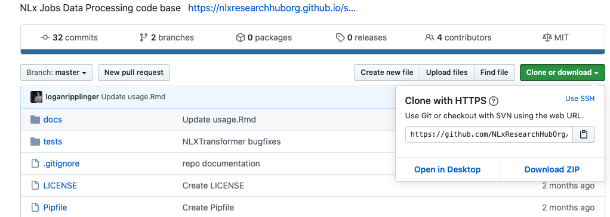
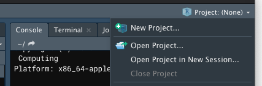
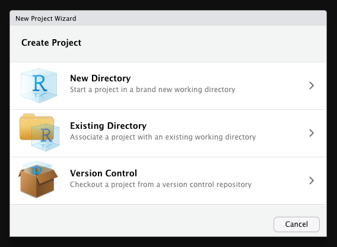
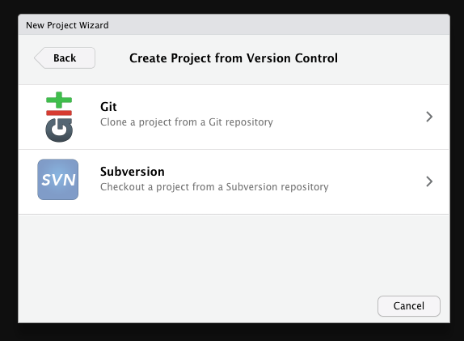
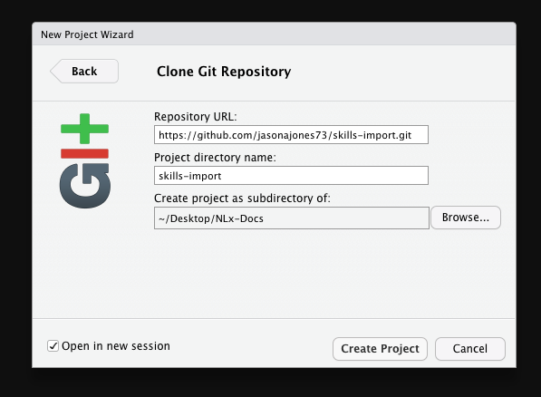
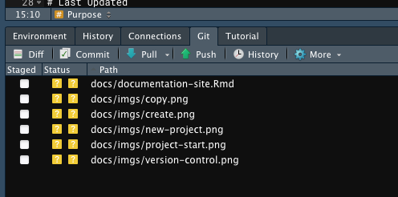
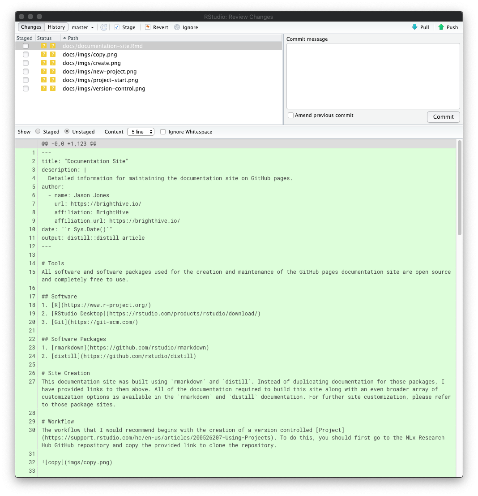
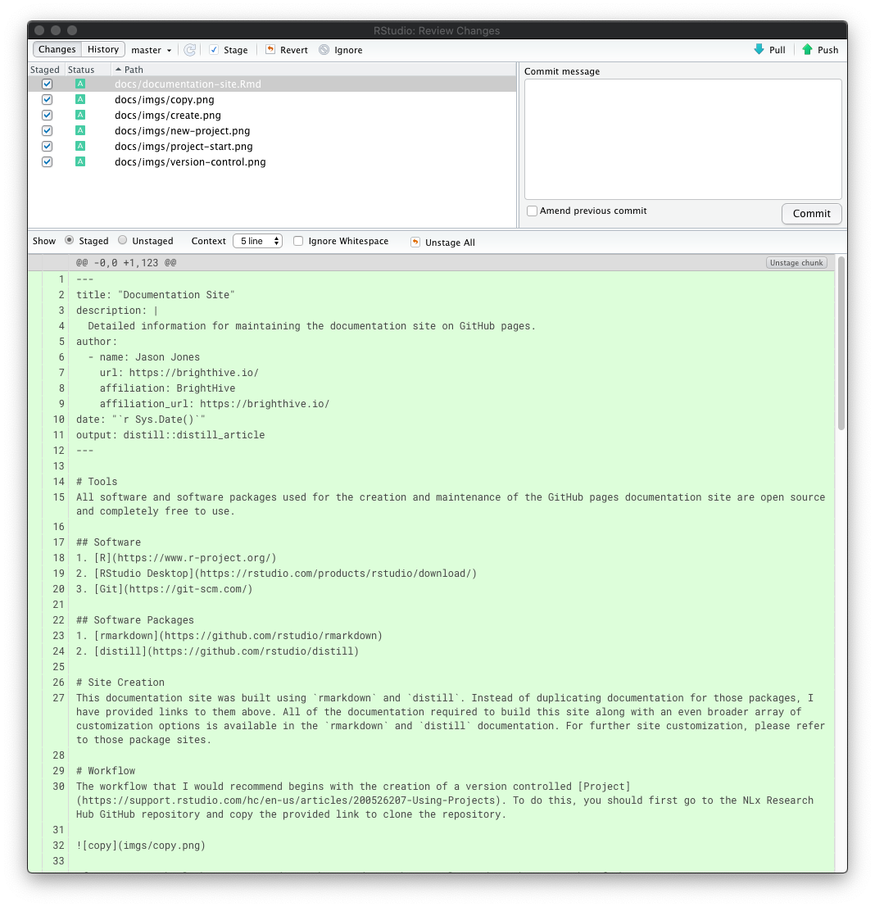
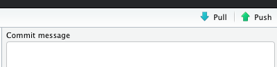

# Tools
All software and software packages used for the creation and maintenance of the GitHub pages documentation site are open source and completely free to use.

## Software
1. [R](https://www.r-project.org/)
2. [RStudio Desktop](https://rstudio.com/products/rstudio/download/)
3. [Git](https://git-scm.com/)

## Software Packages
1. [rmarkdown](https://github.com/rstudio/rmarkdown)
2. [distill](https://github.com/rstudio/distill)

# Site Creation
This documentation site was built using `rmarkdown` and `distill`. Instead of duplicating documentation for those packages, I have provided links to them above. All of the documentation required to build this site along with an even broader array of customization options is available in the `rmarkdown` and `distill` documentation. For further site customization, please refer to those package sites.

# Workflow
The workflow that I would recommend begins with the creation of a version controlled [Project](https://support.rstudio.com/hc/en-us/articles/200526207-Using-Projects). To do this, you should first go to the NLx Research Hub GitHub repository and copy the provided link to clone the repository.

After copying the link, go to RStudio Desktop and use the menu located at the top right of the IDE to create a new project.

At the first prompt, please select Version Control.

At the second prompt, please select Git.

At the third prompt, paste in the GitHub repository link that you copied earlier. The Project directory name should populate automatically, but if not, use the same name as the GitHub repository (skills-import). You can accept the default location for where the Project directory will be created on your computer or you can use the Browse button to choose where you would like for the project directory to be created.

Once you click Create Project, a local version controlled copy of the remote GitHub repository will be created for you in an R Project environment.

# Site Location
The documentation site is all contained within the docs folder of the repository. If you would like to make changes, please only open and edit files that end in `.Rmd`. When building the site, these files are processed and converted to `.html`. Further information regarding this can be found in the `distill` package documentation provided above. Everything you need is provided in that documentation if you would like to further customize the site by adding additional pages, images, or links

# Site Build
Following the `distill` package documentation found here - [Building the Site](https://rstudio.github.io/distill/website.html#building-the-site) - it is recommended that you build the site with following command in your active R console: `rmarkdown::render_site()`. 

It is important to note that you will need to make sure your active working directory is the `docs` folder. 

Once this command is run within the `docs` folder, your site will automatically build for you.

# Pushing Changes

Click the Git tab within your RStudio IDE.

Now click the Diff button within your Git tab. It should open a prompt that looks like this.

Select all of your changed files and click the Stage button.

Then type a description in the Commit message dialog box. After typing your message click commit. All of your changes will now be committed locally. The final step is pushing these changes to your remote repository. Click the push button at the top right of the dialog.

You may be prompted to enter your GitHub username and password if you have not already gone through the process of authenticating. After pushing your changes, any updates you made should now be automatically pulled in and published via GitHub pages.